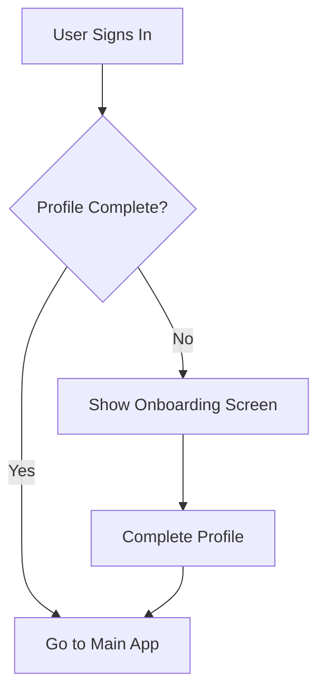

# Qred Onboarding Implementation

## 📋 Overview

This document outlines the comprehensive onboarding system implementation for Qred, which ensures new users complete their profile setup before accessing the main application features.

**Implementation Date:** December 19, 2024
**Status:** ✅ Complete
**Dependencies:** Supabase Auth, Supabase Storage, Expo Image Picker

## 🎯 Features Implemented

### ✅ Core Onboarding Features

1. **Profile Completion Detection**
   - Automatic detection of incomplete profiles
   - Smart routing to onboarding screen
   - Profile completion validation logic

2. **Avatar Upload System**
   - Supabase Storage integration
   - Image picker with camera/gallery options
   - File size validation (5MB limit)
   - Supported formats: JPG, PNG, WebP

3. **Enhanced Profile Management**
   - In-app profile editing with avatar upload
   - Profile picture display throughout the app
   - Validation and error handling

4. **Seamless Navigation Flow**
   - Conditional navigation based on profile status
   - Skip option for immediate app access
   - Persistent onboarding state management

## 🏗 Architecture

### File Structure

```
qred/
├── components/
│   ├── screens/auth/
│   │   ├── OnboardingScreen.tsx      # Main onboarding interface
│   │   └── ...
│   ├── screens/profile/
│   │   ├── ProfileScreen.tsx         # Enhanced with avatar upload
│   │   └── ...
│   ├── ui/
│   │   ├── image.tsx                 # Image component wrapper
│   │   └── pressable.tsx             # Pressable component wrapper
│   └── navigation/
│       ├── AppNavigator.tsx          # Updated with onboarding flow
│       └── AuthStack.tsx             # Added onboarding route
├── lib/
│   ├── services/
│   │   ├── storageService.ts         # Supabase Storage operations
│   │   └── authService.ts            # Enhanced with profile checks
│   ├── store/
│   │   └── authStore.ts              # Added onboarding state
│   └── types/
│       └── index.ts                  # Updated navigation types
├── scripts/
│   ├── init-storage.ts               # Storage bucket initialization
│   └── test-onboarding.ts            # Onboarding flow tests
└── docs/
    └── ONBOARDING_IMPLEMENTATION.md  # This document
```

### State Management

The onboarding system integrates with the existing Zustand auth store:

```typescript
interface AuthState {
  // ... existing state
  needsOnboarding: boolean;
}

interface AuthActions {
  // ... existing actions
  setNeedsOnboarding: (needsOnboarding: boolean) => void;
  checkProfileCompletion: () => boolean;
}
```

### Profile Completion Logic

A user's profile is considered complete when:
- `name` field exists and is not empty
- Name is not a default value ("User" or "Qred User")
- Name contains meaningful content (not just whitespace)

```typescript
checkProfileCompletion: () => {
  const { user } = get();
  if (!user) return false;

  const hasName = user.name &&
    user.name.trim() !== "" &&
    user.name !== "User" &&
    user.name !== "Qred User";

  return !!hasName;
}
```

## 🔄 User Flow

### New User Registration Flow

```mermaid
graph TD
    A[User Signs Up] --> B{Profile Complete?}
    B -->|No| C[Show Onboarding Screen]
    B -->|Yes| D[Go to Main App]
    C --> E[User Completes Profile]
    C --> F[User Skips Profile]
    E --> G[Upload Avatar (Optional)]
    G --> H[Save Profile]
    H --> D
    F --> D
```

### Existing User Flow



## 📱 User Interface

### Onboarding Screen Features

1. **Header Section**
   - Welcome message
   - Clear instructions
   - Professional branding

2. **Avatar Upload Section**
   - Large, prominent avatar area
   - Camera/gallery picker options
   - Visual feedback for selection
   - File size validation

3. **Profile Form**
   - Full name input (required)
   - Phone number input (optional)
   - Real-time validation
   - Clear error messages

4. **Action Buttons**
   - Primary: "Complete Profile"
   - Secondary: "Skip for Now"
   - Loading states and disabled states

5. **Legal Notice**
   - Terms of service acknowledgment
   - Privacy policy reference

### Profile Screen Enhancements

1. **Avatar Display**
   - Profile picture or initials fallback
   - Edit mode with camera overlay
   - Tap-to-change functionality

2. **Enhanced Edit Mode**
   - Avatar upload integration
   - Progress indicators
   - Error handling for uploads

## 🔧 Implementation Details

### Storage Service

The `storageService.ts` provides comprehensive avatar management:

```typescript
class StorageService {
  // Upload avatar with validation
  async uploadAvatar(request: UploadAvatarRequest): Promise<UploadAvatarResponse>

  // Delete old avatars
  async deleteAvatar(avatarPath: string): Promise<void>

  // Get public URLs
  getAvatarUrl(avatarPath: string): string

  // Cleanup old files
  async cleanupOldAvatars(userId: string, keepCount: number): Promise<void>
}
```

### Navigation Integration

The main navigator conditionally renders screens based on authentication and onboarding status:

```typescript
{isAuthenticated ? (
  needsOnboarding ? (
    <Stack.Screen name="Onboarding" component={OnboardingScreen} />
  ) : (
    <Stack.Screen name="Main" component={MainTabNavigator} />
  )
) : (
  <Stack.Screen name="Auth" component={AuthStack} />
)}
```

### Image Picker Integration

Uses Expo Image Picker with comprehensive options:

```typescript
const result = await ImagePicker.launchImageLibraryAsync({
  mediaTypes: ImagePicker.MediaTypeOptions.Images,
  allowsEditing: true,
  aspect: [1, 1],
  quality: 0.8,
});
```

## 🔐 Security & Permissions

### Required Permissions

**iOS (Info.plist):**
- `NSCameraUsageDescription`
- `NSPhotoLibraryUsageDescription`

**Android (AndroidManifest.xml):**
- `CAMERA`
- `READ_EXTERNAL_STORAGE`
- `WRITE_EXTERNAL_STORAGE`

### Data Validation

1. **File Size Limits**
   - Maximum 5MB per image
   - Client-side validation before upload

2. **File Type Validation**
   - Supported: JPG, PNG, WebP
   - MIME type checking

3. **Input Validation**
   - Name: Required, non-empty, non-default
   - Phone: Optional but must be valid Nigerian format if provided

## 📊 Testing

### Automated Tests

1. **Profile Completion Logic Test**
   ```bash
   npm run test:onboarding
   ```

2. **Storage Initialization Test**
   ```bash
   npm run init:storage
   ```

### Test Coverage

- ✅ Profile completion detection
- ✅ Navigation flow routing
- ✅ Form validation logic
- ✅ Default name handling
- ✅ Edge cases (empty strings, whitespace)

### Manual Testing Scenarios

1. **New Email User**
   - Sign up with email
   - Should see onboarding screen
   - Complete profile → should go to main app

2. **New Phone User**
   - Sign up with phone/OTP
   - Should see onboarding screen
   - Skip profile → should go to main app with minimal profile

3. **Returning User**
   - Sign in with complete profile
   - Should go directly to main app
   - Sign in with incomplete profile → should see onboarding

4. **Avatar Upload**
   - Select from gallery → should upload successfully
   - Take photo → should upload successfully
   - Large file → should show error message

## 🚀 Deployment Checklist

### Pre-Deployment

- [ ] **Supabase Storage Bucket Setup**
  - Create `avatars` bucket in Supabase Dashboard
  - Set bucket to public
  - Configure RLS policies if needed

- [ ] **Environment Variables**
  - Verify `EXPO_PUBLIC_SUPABASE_URL`
  - Verify `EXPO_PUBLIC_SUPABASE_ANON_KEY`

- [ ] **App Permissions**
  - iOS: Info.plist updated with camera/photo permissions
  - Android: Manifest updated with storage/camera permissions

### Post-Deployment

- [ ] **Monitor Storage Usage**
  - Track uploaded file sizes
  - Monitor bucket usage in Supabase Dashboard

- [ ] **User Analytics**
  - Track onboarding completion rates
  - Monitor skip vs complete ratios

## 🔍 Troubleshooting

### Common Issues

1. **Storage Bucket Not Found**
   - **Cause:** Bucket not created in Supabase Dashboard
   - **Solution:** Manually create `avatars` bucket with public access

2. **Image Upload Fails**
   - **Cause:** Network issues or bucket permissions
   - **Solution:** Check Supabase connection and bucket policies

3. **Camera/Gallery Not Working**
   - **Cause:** Missing permissions
   - **Solution:** Verify app.json permissions and device settings

4. **Onboarding Loop**
   - **Cause:** Profile completion logic not detecting valid names
   - **Solution:** Check `checkProfileCompletion()` logic in auth store

### Debug Commands

```bash
# Test Supabase connection
npm run test:supabase

# Test onboarding logic
npm run test:onboarding

# Initialize storage bucket (admin required)
npm run init:storage
```

## 🔮 Future Enhancements

### Planned Features

1. **Advanced Avatar Features**
   - Image cropping and filters
   - Multiple avatar sizes/thumbnails
   - Avatar history management

2. **Enhanced Onboarding**
   - Multi-step wizard
   - Progress indicators
   - Personalization questions

3. **Social Features**
   - Import profile from social platforms
   - Contact sync for friend finding
   - Profile sharing capabilities

### Technical Improvements

1. **Performance Optimization**
   - Image compression
   - Lazy loading for avatars
   - Caching strategies

2. **Accessibility**
   - Screen reader support
   - High contrast mode
   - Voice navigation

3. **Analytics Integration**
   - Onboarding funnel tracking
   - A/B testing framework
   - User engagement metrics

## 📚 References

### Documentation
- [Supabase Storage Documentation](https://supabase.com/docs/guides/storage)
- [Expo Image Picker Documentation](https://docs.expo.dev/versions/latest/sdk/imagepicker/)
- [React Navigation Documentation](https://reactnavigation.org/)

### Code Examples
- See `components/screens/auth/OnboardingScreen.tsx` for complete implementation
- See `lib/services/storageService.ts` for storage operations
- See `scripts/test-onboarding.ts` for testing examples

---

**Implementation Status:** ✅ **Production Ready**

This onboarding system provides a complete, secure, and user-friendly way for new users to set up their profiles with avatar support. The implementation follows React Native best practices and integrates seamlessly with the existing Supabase-based architecture.
